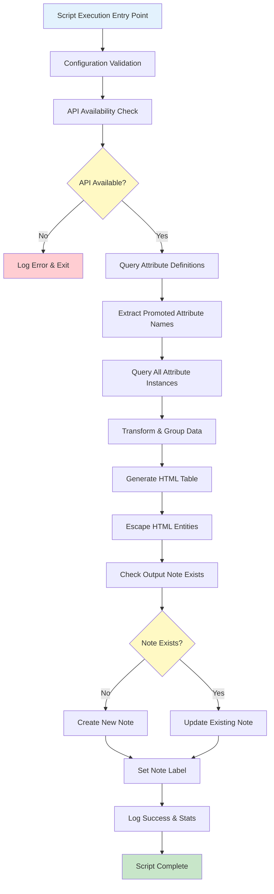
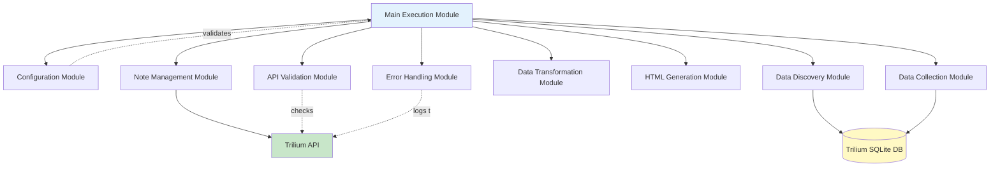
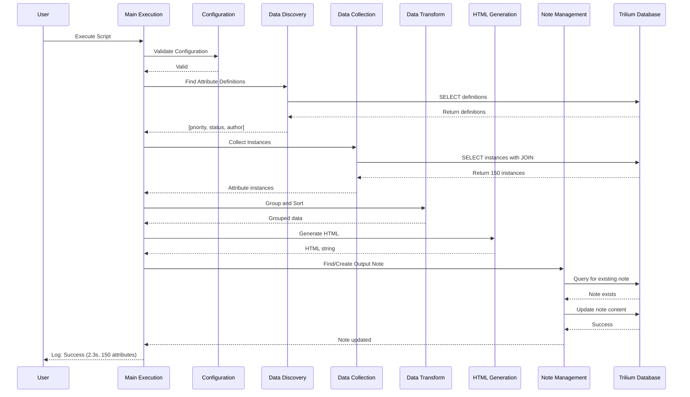
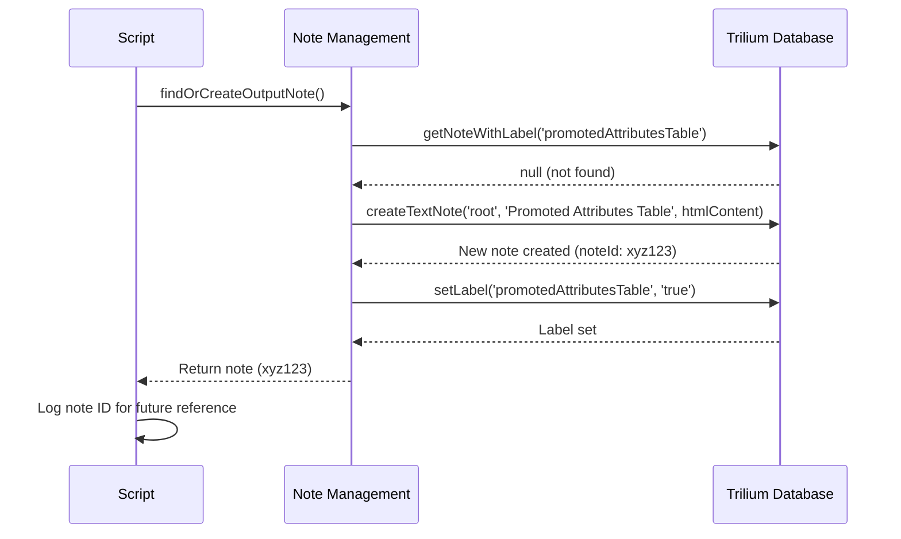
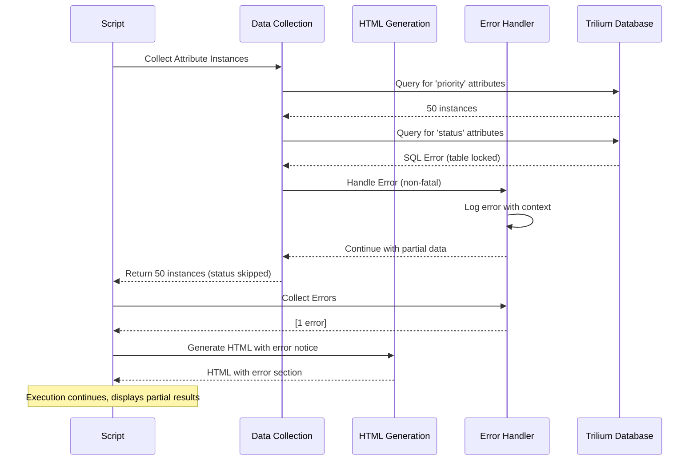
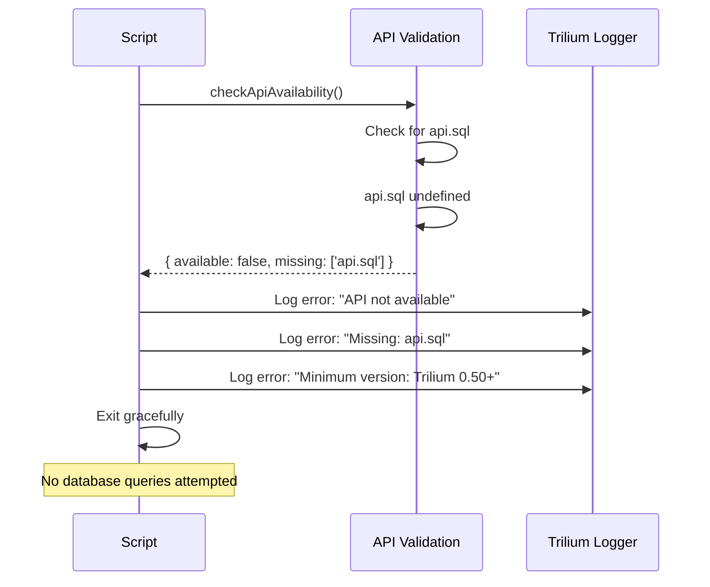

# Architecture Document
# Trilium Promoted Attributes Table Script

**Version:** 1.0
**Date:** 2025-10-13
**Status:** Draft
**Architect:** Winston
**Related Documents:** [PRD](./prd.md), [Project Brief](./brief.md), [Research Findings](./research-findings.md)

---

## Document Control

| Date | Version | Description | Author |
|------|---------|-------------|--------|
| 2025-10-13 | 1.0 | Initial architecture document | Winston |

---

## Table of Contents

1. [Introduction](#introduction)
2. [High-Level Architecture](#high-level-architecture)
3. [Tech Stack](#tech-stack)
4. [Data Models](#data-models)
5. [Components](#components)
6. [Core Workflows](#core-workflows)
7. [Database Schema](#database-schema)
8. [Source Tree](#source-tree)
9. [Error Handling Strategy](#error-handling-strategy)
10. [Coding Standards](#coding-standards)
11. [Test Strategy](#test-strategy)
12. [Security](#security)
13. [Next Steps](#next-steps)

---

## Introduction

This document outlines the technical architecture for the **Trilium Promoted Attributes Table Script**, a single-file JavaScript backend script that generates comprehensive tables of promoted attributes from Trilium Notes databases. This architecture is designed to guide AI-driven development and ensure consistency with Trilium's scripting best practices.

### Project Context

**From the PRD:**
- **Goal:** Create a lightweight, efficient script that queries Trilium's database for promoted attributes and generates an HTML table in a dedicated note
- **Target Users:** Trilium power users managing 500-10,000 notes with 10-50 promoted attributes
- **Performance Target:** < 5 seconds execution for databases with 10,000 notes
- **Deployment:** Single `.js` file, no external dependencies

**From Research Findings:**
- **Feasibility Confirmed:** Trilium API provides complete support via `api.sql` and note manipulation methods
- **Recommended Approach:** SQL-based queries for performance, HTML table output for native rendering
- **Critical APIs:** `api.sql.getRows()`, `api.createTextNote()`, `note.setContent()`, `note.setLabel()`

### Architectural Philosophy

This is a **pragmatic, single-purpose script** architecture optimized for:

1. **Simplicity:** Single file, no complex abstractions
2. **Performance:** Direct SQL queries over API iteration
3. **Maintainability:** Clear function separation, extensive comments
4. **Safety:** Read-only operations on source data, defensive error handling
5. **Trilium-Native:** Leverages platform capabilities, respects conventions

### Starter Template / Existing Project

**N/A** - This is a greenfield single-file script with no starter template. The script will be created from scratch following Trilium's backend script patterns observed in the `reference/examples/trilium-scripts/` directory.

**Key Patterns from Example Scripts:**
- Configuration objects at top of file
- Async main function pattern
- Use of `api.sql.getRows()` for database access
- Use of `api.currentNote` and `api.log()` for context
- Try-catch error handling with logging

---

## High-Level Architecture

### Technical Summary

The Trilium Promoted Attributes Table Script is a **single-file, synchronous-execution backend script** that operates within Trilium's Node.js-based scripting environment. It uses a **sequential data pipeline architecture**: discover definitions → query attributes → generate HTML → create/update note. The script employs **direct SQL queries** for optimal performance and **functional decomposition** for maintainability, generating self-contained HTML output that renders natively in Trilium notes.

### High-Level Overview

**Architectural Style:** **Sequential Data Pipeline (Single-File Script)**

**Key Characteristics:**
1. **Execution Model:** Synchronous, single-threaded execution triggered manually or on schedule
2. **Data Access Pattern:** Read-only SQL queries via Trilium API (`api.sql`)
3. **Processing Flow:** Linear pipeline with distinct stages
4. **Output Strategy:** HTML generation for native Trilium rendering
5. **State Management:** Stateless execution (no persistent state between runs)

**Repository Structure:** **Single-File Script** (no repository structure needed)

**Service Architecture:** **Monolithic Script** - All logic in one file

**Primary Data Flow:**

```
1. Script Execution Triggered
   ↓
2. Discover Promoted Attribute Definitions (SQL Query)
   ↓
3. Query Attribute Instances (SQL Query with JOIN)
   ↓
4. Transform Data (Group by attribute, sort)
   ↓
5. Generate HTML Table (String templating)
   ↓
6. Create/Update Output Note (Trilium API)
   ↓
7. Log Results & Complete
```

**Key Architectural Decisions:**

| Decision | Rationale | Trade-offs |
|----------|-----------|------------|
| **SQL-based queries** | 10-100x faster than API iteration for large datasets | Lower-level, requires schema knowledge |
| **Single-file design** | Simple deployment, no build process, easy to understand | Limited to ~500 LOC, no code reuse across scripts |
| **HTML output format** | Native Trilium rendering, no parsing needed, rich styling | Not easily parseable by other tools |
| **Stateless execution** | Simple, reliable, no side effects between runs | Must recompute everything each run |
| **Backend script** | Full API access, database access, server-side reliability | Cannot interact with UI directly |

### High-Level Project Diagram



### Architectural and Design Patterns

The following patterns guide the script's design:

- **Sequential Pipeline Pattern:** Data flows through distinct stages: Discovery → Collection → Transformation → Rendering → Persistence
  - *Rationale:* Clear separation of concerns, easy to understand and debug, matches natural data flow

- **Configuration Object Pattern:** All configurable values in a single `CONFIG` constant at file top
  - *Rationale:* Single source of truth for configuration, no magic numbers, easy customization without code changes

- **Functional Decomposition Pattern:** Break main execution into pure functions with single responsibilities
  - *Rationale:* Testability, reusability, clarity - each function does one thing well

- **Template Method Pattern:** HTML generation uses string templating with helper functions
  - *Rationale:* Separation of data from presentation, easier to modify output format

- **Defensive Programming Pattern:** Validate inputs, handle errors gracefully, log extensively
  - *Rationale:* Script runs in user databases - must never corrupt data or crash Trilium

- **Fail-Safe Defaults Pattern:** All configuration has safe defaults, missing values don't break execution
  - *Rationale:* Works out-of-box, degrades gracefully when things go wrong

---

## Tech Stack

This section defines the **definitive technology choices** for the project. All development must use these exact versions and tools.

### Cloud Infrastructure

**N/A** - This script runs entirely within the user's local Trilium instance. No cloud services or external infrastructure required.

### Technology Stack Table

| Category | Technology | Version | Purpose | Rationale |
|----------|-----------|---------|---------|-----------|
| **Language** | JavaScript (ECMAScript) | ES2020+ | Primary scripting language | Required by Trilium backend environment, modern JS features (async/await, optional chaining) |
| **Runtime** | Node.js | 18.x+ (Trilium's bundled version) | JavaScript execution environment | Embedded in Trilium, provides APIs and SQLite access |
| **Database** | SQLite | 3.x (Trilium's bundled version) | Data storage (read-only access) | Trilium's native database, accessed via `api.sql` |
| **Database Driver** | better-sqlite3 | (via Trilium API) | SQLite interface | Provided by Trilium, accessed through `api.sql.getRows()` |
| **Templating** | Template Literals | ES2015+ | HTML generation | Native JS feature, no library needed, sufficient for our needs |
| **Logging** | Trilium Logger | (Trilium built-in) | Script logging | `api.log()` integrates with Trilium's log viewer |
| **Testing** | Manual Testing | N/A | Initial validation | MVP approach, automated tests in Phase 2 |
| **Linting** | ESLint (optional) | 8.x | Code quality (developer's choice) | Not required but recommended for development |
| **Documentation** | JSDoc | 3.x | Inline code documentation | Standard JavaScript documentation format |

**Critical Dependencies (All provided by Trilium):**

```javascript
// Available via Trilium's api object
api.sql.getRows(query, params)  // Database access
api.createTextNote(parentId, title, content)  // Note creation
api.getNote(noteId)  // Note retrieval
api.getNoteWithLabel(name, value)  // Note search
api.currentNote  // Script context
api.log(message)  // Logging
api.dayjs  // Date/time library (if needed)
```

**No External Dependencies:**
- ✅ No npm packages
- ✅ No external libraries
- ✅ No build tools
- ✅ No transpilation
- ✅ Works with vanilla JavaScript

**Minimum Trilium Version:** 0.60+ (recommended), 0.50+ (minimum)
- Requires `api.sql` access
- Requires note creation APIs
- Research confirmed availability in 0.50+

**Platform Compatibility:**
- ✅ Trilium Desktop (Windows, macOS, Linux)
- ✅ Trilium Server
- ✅ No browser-specific APIs used
- ✅ Node.js backend only

---

## Data Models

The script operates on Trilium's native data models. Below are the conceptual models used during execution.

### AttributeDefinition Model

**Purpose:** Represents a promoted attribute definition discovered in the database

**Key Attributes:**
- `name`: String - The definition label name (e.g., "label:priority", "relation:author")
- `type`: String - Type of definition ("label" or "relation")
- `baseName`: String - Extracted attribute name (e.g., "priority", "author")

**Relationships:**
- Has many `AttributeInstance` records (one-to-many)

**Source:** Extracted from `attributes` table where `name LIKE 'label:%' OR name LIKE 'relation:%'`

---

### AttributeInstance Model

**Purpose:** Represents a single attribute value on a note

**Key Attributes:**
- `attributeId`: String - Unique identifier
- `name`: String - Attribute name (e.g., "priority")
- `value`: String - Attribute value (e.g., "high")
- `type`: String - "label" or "relation"
- `noteId`: String - Parent note ID
- `noteTitle`: String - Parent note title (for display)

**Relationships:**
- Belongs to one `AttributeDefinition` (many-to-one)
- Belongs to one Note (many-to-one)

**Source:** Joined query from `attributes` and `notes` tables

---

### AttributeGroup Model

**Purpose:** Represents a collection of attribute instances grouped by name (used for rendering)

**Key Attributes:**
- `attributeName`: String - Common attribute name
- `instances`: Array<AttributeInstance> - All instances with this name
- `count`: Number - Number of instances

**Relationships:**
- Contains multiple `AttributeInstance` records

**Lifecycle:** Constructed in-memory during transformation stage, not persisted

---

### OutputMetadata Model

**Purpose:** Execution metadata included in output note

**Key Attributes:**
- `timestamp`: String - ISO 8601 timestamp of generation
- `executionTime`: Number - Milliseconds taken to execute
- `totalDefinitions`: Number - Count of attribute definitions found
- `totalInstances`: Number - Count of attribute instances found
- `noteCount`: Number - Count of distinct notes with attributes
- `errorCount`: Number - Count of errors encountered (if any)

**Relationships:** None

**Lifecycle:** Computed during execution, rendered in HTML header

---

## Components

Since this is a single-file script, "components" refer to logical function groupings rather than separate modules.

### Component 1: Configuration Module

**Responsibility:** Define and validate all configurable script behavior

**Key Interfaces:**
```javascript
const CONFIG = {
  outputNoteTitle: String,
  outputNoteParent: String,
  outputNoteLabel: String,
  includeInheritedAttributes: Boolean,
  includeArchivedNotes: Boolean,
  excludeSystemNotes: Boolean,
  groupByAttribute: Boolean,
  showUsageCount: Boolean,
  maxValueLength: Number,
  maxResults: Number,
  queryTimeout: Number,
  verboseLogging: Boolean,
  dryRun: Boolean
};

function validateConfig(config) → Boolean
```

**Dependencies:** None

**Technology Stack:** Pure JavaScript object, no special handling needed

---

### Component 2: API Validation Module

**Responsibility:** Check Trilium API availability and version compatibility

**Key Interfaces:**
```javascript
function checkApiAvailability() → { available: Boolean, missing: Array<String> }
function checkMinimumVersion() → Boolean
```

**Dependencies:**
- Trilium `api` object

**Technology Stack:** Checks for existence of `api.sql`, `api.createTextNote`, etc.

---

### Component 3: Data Discovery Module

**Responsibility:** Query and identify all promoted attribute definitions

**Key Interfaces:**
```javascript
function findPromotedAttributeDefinitions() → Promise<Array<AttributeDefinition>>
function extractAttributeNames(definitions) → Array<String>
```

**Dependencies:**
- `api.sql.getRows()`
- Configuration (for filtering options)

**Technology Stack:** SQL queries via Trilium API

**SQL Queries Used:**
```sql
SELECT DISTINCT name, type
FROM attributes
WHERE (name LIKE 'label:%' OR name LIKE 'relation:%')
  AND isDeleted = 0
```

---

### Component 4: Data Collection Module

**Responsibility:** Query all attribute instances for discovered definitions

**Key Interfaces:**
```javascript
function collectAttributeInstances(attributeNames) → Promise<Array<AttributeInstance>>
function filterAttributesByConfig(instances) → Array<AttributeInstance>
```

**Dependencies:**
- `api.sql.getRows()`
- Configuration (for include/exclude filters)
- Data Discovery Module output

**Technology Stack:** SQL queries with JOINs

**SQL Queries Used:**
```sql
SELECT a.name, a.value, a.type, n.noteId, n.title
FROM attributes a
JOIN notes n ON a.noteId = n.noteId
WHERE a.name IN (?)
  AND a.isDeleted = 0
  AND n.isDeleted = 0
ORDER BY a.name, n.title
```

---

### Component 5: Data Transformation Module

**Responsibility:** Transform raw attribute data into grouped, sorted structure for rendering

**Key Interfaces:**
```javascript
function groupAttributesByName(instances) → Array<AttributeGroup>
function sortAttributeGroups(groups) → Array<AttributeGroup>
function calculateStatistics(groups) → OutputMetadata
```

**Dependencies:**
- Data Collection Module output

**Technology Stack:** Pure JavaScript array manipulation

**Transformation Logic:**
1. Group instances by `attributeName`
2. Sort groups alphabetically by name
3. Sort instances within each group by `noteTitle`
4. Calculate counts and statistics

---

### Component 6: HTML Generation Module

**Responsibility:** Generate HTML table markup from transformed data

**Key Interfaces:**
```javascript
function generateHtmlTable(groups, metadata) → String
function escapeHtml(text) → String
function generateTableHeader(metadata) → String
function generateTableRow(instance) → String
function generateGroupHeader(group) → String
function generateEmptyState() → String
function generateErrorState(errors) → String
```

**Dependencies:**
- Data Transformation Module output
- Configuration (for display options)

**Technology Stack:** Template literals, string concatenation

**HTML Structure:**
- Wrapper div with inline styles
- Header section with metadata
- Table with thead/tbody
- Group headers as special rows
- Note links using Trilium's `#root/noteId` format
- Footer with script attribution

---

### Component 7: Note Management Module

**Responsibility:** Create or update the output note with generated HTML

**Key Interfaces:**
```javascript
function findOrCreateOutputNote() → Promise<BNote>
function updateNoteContent(note, htmlContent) → Promise<void>
function setNoteMetadata(note) → Promise<void>
```

**Dependencies:**
- `api.getNoteWithLabel()`
- `api.createTextNote()`
- `api.getNote()`
- `note.setContent()`
- `note.setLabel()`
- Configuration (for output note settings)

**Technology Stack:** Trilium Note API

**Note Management Logic:**
1. Search for existing note by label (`#promotedAttributesTable`)
2. If not found, create new note under configured parent
3. Update note content with HTML
4. Ensure identifying label is set
5. Return note ID for logging

---

### Component 8: Error Handling Module

**Responsibility:** Catch, log, and report errors gracefully

**Key Interfaces:**
```javascript
function handleError(error, context) → void
function logError(message, error, context) → void
function collectErrors() → Array<Error>
function shouldContinueOnError(error) → Boolean
```

**Dependencies:**
- `api.log()`

**Technology Stack:** Try-catch blocks, error accumulation

**Error Handling Strategy:**
- Catch errors at component boundaries
- Log with context (operation name, parameters)
- Accumulate non-fatal errors
- Continue processing when possible
- Display error summary in output

---

### Component 9: Main Execution Module

**Responsibility:** Orchestrate all components in correct sequence

**Key Interfaces:**
```javascript
async function generatePromotedAttributesTable() → Promise<void>
function measureExecutionTime(fn) → Promise<{ result, duration }>
```

**Dependencies:** All other components

**Technology Stack:** Async/await, promise handling

**Execution Flow:**
```javascript
1. Validate configuration
2. Check API availability
3. Start timer
4. Discover attribute definitions
5. Collect attribute instances
6. Transform and group data
7. Generate HTML
8. Find/create output note
9. Update note content
10. Stop timer
11. Log results
12. Handle errors
```

---

### Component Diagram



---

## Core Workflows

### Workflow 1: Full Script Execution (Happy Path)



---

### Workflow 2: First Run (Note Creation)



---

### Workflow 3: Error Handling (Partial Failure)



---

### Workflow 4: API Validation Failure



---

## Database Schema

The script reads from Trilium's existing database schema. It **does not modify or extend** the schema.

### Attributes Table (Read-Only Access)

```sql
-- Trilium's native attributes table structure
CREATE TABLE attributes (
    attributeId TEXT PRIMARY KEY,
    noteId TEXT NOT NULL,
    type TEXT NOT NULL,  -- 'label' or 'relation'
    name TEXT NOT NULL,
    value TEXT,
    isInheritable INTEGER NOT NULL DEFAULT 0,
    position INTEGER NOT NULL DEFAULT 0,
    isDeleted INTEGER NOT NULL DEFAULT 0,
    deleteId TEXT,
    utcDateCreated TEXT NOT NULL,
    utcDateModified TEXT NOT NULL,

    FOREIGN KEY(noteId) REFERENCES notes(noteId)
);

CREATE INDEX IDX_attributes_noteId ON attributes(noteId);
CREATE INDEX IDX_attributes_name ON attributes(name);
CREATE INDEX IDX_attributes_type ON attributes(type);
```

**Columns Used by Script:**
- `attributeId` - Unique identifier (not currently used but available)
- `noteId` - Foreign key to notes table
- `type` - Filter for labels vs relations
- `name` - Attribute name (e.g., "priority", "label:priority")
- `value` - Attribute value
- `isDeleted` - Filter out soft-deleted attributes

---

### Notes Table (Read-Only Access)

```sql
-- Trilium's native notes table structure
CREATE TABLE notes (
    noteId TEXT PRIMARY KEY,
    title TEXT NOT NULL DEFAULT '',
    type TEXT NOT NULL DEFAULT 'text',
    mime TEXT NOT NULL DEFAULT 'text/html',
    isProtected INTEGER NOT NULL DEFAULT 0,
    isDeleted INTEGER NOT NULL DEFAULT 0,
    deleteId TEXT,
    dateCreated TEXT NOT NULL,
    dateModified TEXT NOT NULL,
    utcDateCreated TEXT NOT NULL,
    utcDateModified TEXT NOT NULL
);

CREATE INDEX IDX_notes_title ON notes(title);
CREATE INDEX IDX_notes_type ON notes(type);
```

**Columns Used by Script:**
- `noteId` - Primary key, used in joins and note links
- `title` - Displayed in attribute table
- `isDeleted` - Filter out soft-deleted notes

---

### Query Patterns

**Pattern 1: Find Attribute Definitions**
```sql
SELECT DISTINCT name, type
FROM attributes
WHERE (name LIKE 'label:%' OR name LIKE 'relation:%')
  AND isDeleted = 0
ORDER BY name;
```

**Pattern 2: Collect Attribute Instances (Parameterized)**
```sql
SELECT
    a.name AS attributeName,
    a.value AS attributeValue,
    a.type AS attributeType,
    n.noteId AS noteId,
    n.title AS noteTitle
FROM attributes a
INNER JOIN notes n ON a.noteId = n.noteId
WHERE a.name = ?
  AND a.type = 'label'
  AND a.isDeleted = 0
  AND n.isDeleted = 0
ORDER BY n.title ASC;
```

**Pattern 3: Optimized Single Query (All Attributes)**
```sql
SELECT
    a.name AS attributeName,
    a.value AS attributeValue,
    a.type AS attributeType,
    n.noteId AS noteId,
    n.title AS noteTitle
FROM attributes a
INNER JOIN notes n ON a.noteId = n.noteId
WHERE a.type = 'label'
  AND a.name IN (
    SELECT DISTINCT SUBSTR(name, 7)
    FROM attributes
    WHERE name LIKE 'label:%'
      AND isDeleted = 0
  )
  AND a.isDeleted = 0
  AND n.isDeleted = 0
ORDER BY a.name ASC, n.title ASC;
```

**Query Performance Considerations:**
- Use indexes on `name` and `noteId` (already exist in Trilium schema)
- Parameterize queries to prevent SQL injection
- Use `INNER JOIN` for better performance than multiple queries
- Filter `isDeleted = 0` early in WHERE clause
- Limit results with `LIMIT ?` if CONFIG.maxResults is set

---

## Source Tree

Since this is a single-file script, the "source tree" is minimal:

```plaintext
trilium-promoted-attributes-script/
├── promoted-attributes-table.js    # Main script file (~400-500 LOC)
├── README.md                        # Installation and usage documentation
├── LICENSE                          # Open source license (MIT recommended)
├── CHANGELOG.md                     # Version history
└── examples/
    └── sample-output.png            # Screenshot of generated table
```

**Script File Structure (promoted-attributes-table.js):**

```javascript
// ============================================================================
// Trilium Promoted Attributes Table Script
// Version: 1.0.0
// Author: [Your Name]
// License: MIT
// Description: Generates a comprehensive table of all promoted attributes
// ============================================================================

// ----------------------------------------------------------------------------
// CONFIGURATION
// ----------------------------------------------------------------------------
const CONFIG = {
    // ... configuration object
};

// ----------------------------------------------------------------------------
// UTILITY FUNCTIONS
// ----------------------------------------------------------------------------

/**
 * Escapes HTML special characters
 * @param {string} text - Text to escape
 * @returns {string} Escaped text
 */
function escapeHtml(text) {
    // ... implementation
}

/**
 * Validates configuration object
 * @param {object} config - Configuration to validate
 * @returns {boolean} True if valid
 */
function validateConfig(config) {
    // ... implementation
}

// ----------------------------------------------------------------------------
// API VALIDATION
// ----------------------------------------------------------------------------

/**
 * Checks if required Trilium APIs are available
 * @returns {{available: boolean, missing: string[]}}
 */
function checkApiAvailability() {
    // ... implementation
}

// ----------------------------------------------------------------------------
// DATA DISCOVERY
// ----------------------------------------------------------------------------

/**
 * Finds all promoted attribute definitions in database
 * @returns {Promise<Array<{name: string, type: string}>>}
 */
async function findPromotedAttributeDefinitions() {
    // ... implementation
}

/**
 * Extracts base attribute names from definitions
 * @param {Array} definitions - Attribute definitions
 * @returns {Array<string>} Base names (e.g., "priority" from "label:priority")
 */
function extractAttributeNames(definitions) {
    // ... implementation
}

// ----------------------------------------------------------------------------
// DATA COLLECTION
// ----------------------------------------------------------------------------

/**
 * Collects all instances of specified attributes
 * @param {Array<string>} attributeNames - Names to query
 * @returns {Promise<Array<AttributeInstance>>}
 */
async function collectAttributeInstances(attributeNames) {
    // ... implementation
}

// ----------------------------------------------------------------------------
// DATA TRANSFORMATION
// ----------------------------------------------------------------------------

/**
 * Groups attribute instances by name
 * @param {Array<AttributeInstance>} instances
 * @returns {Array<AttributeGroup>}
 */
function groupAttributesByName(instances) {
    // ... implementation
}

/**
 * Calculates execution statistics
 * @param {Array<AttributeGroup>} groups
 * @returns {OutputMetadata}
 */
function calculateStatistics(groups) {
    // ... implementation
}

// ----------------------------------------------------------------------------
// HTML GENERATION
// ----------------------------------------------------------------------------

/**
 * Generates complete HTML table
 * @param {Array<AttributeGroup>} groups
 * @param {OutputMetadata} metadata
 * @returns {string} HTML content
 */
function generateHtmlTable(groups, metadata) {
    // ... implementation
}

/**
 * Generates table header section
 * @param {OutputMetadata} metadata
 * @returns {string} HTML header
 */
function generateTableHeader(metadata) {
    // ... implementation
}

/**
 * Generates a single table row
 * @param {AttributeInstance} instance
 * @returns {string} HTML row
 */
function generateTableRow(instance) {
    // ... implementation
}

// ----------------------------------------------------------------------------
// NOTE MANAGEMENT
// ----------------------------------------------------------------------------

/**
 * Finds existing output note or creates new one
 * @returns {Promise<BNote>}
 */
async function findOrCreateOutputNote() {
    // ... implementation
}

/**
 * Updates note content with HTML
 * @param {BNote} note
 * @param {string} htmlContent
 * @returns {Promise<void>}
 */
async function updateNoteContent(note, htmlContent) {
    // ... implementation
}

// ----------------------------------------------------------------------------
// ERROR HANDLING
// ----------------------------------------------------------------------------

/**
 * Handles errors with context
 * @param {Error} error
 * @param {string} context
 */
function handleError(error, context) {
    // ... implementation
}

// ----------------------------------------------------------------------------
// MAIN EXECUTION
// ----------------------------------------------------------------------------

/**
 * Main script execution function
 * Orchestrates all components to generate the attributes table
 */
async function generatePromotedAttributesTable() {
    const startTime = Date.now();
    const errors = [];

    try {
        // 1. Validate configuration
        api.log('[Promoted Attributes] Starting execution...');

        if (!validateConfig(CONFIG)) {
            throw new Error('Invalid configuration');
        }

        // 2. Check API availability
        const apiCheck = checkApiAvailability();
        if (!apiCheck.available) {
            throw new Error(`Missing APIs: ${apiCheck.missing.join(', ')}`);
        }

        // 3. Discover attribute definitions
        const definitions = await findPromotedAttributeDefinitions();
        const attributeNames = extractAttributeNames(definitions);

        if (attributeNames.length === 0) {
            api.log('[Promoted Attributes] No attribute definitions found');
            // Generate empty state HTML
        }

        // 4. Collect attribute instances
        const instances = await collectAttributeInstances(attributeNames);

        // 5. Transform data
        const groups = groupAttributesByName(instances);
        const metadata = calculateStatistics(groups);
        metadata.executionTime = Date.now() - startTime;

        // 6. Generate HTML
        const htmlContent = generateHtmlTable(groups, metadata);

        // 7. Update output note
        const outputNote = await findOrCreateOutputNote();
        await updateNoteContent(outputNote, htmlContent);

        // 8. Log success
        const duration = (Date.now() - startTime) / 1000;
        api.log(`[Promoted Attributes] Success! Generated table with ${metadata.totalInstances} attributes in ${duration.toFixed(2)}s`);
        api.log(`[Promoted Attributes] Output note ID: ${outputNote.noteId}`);

    } catch (error) {
        handleError(error, 'Main execution');
        throw error; // Re-throw to ensure Trilium shows error state
    }
}

// ----------------------------------------------------------------------------
// SCRIPT ENTRY POINT
// ----------------------------------------------------------------------------

// Execute the script
generatePromotedAttributesTable();
```

**File Size Estimate:** 400-500 lines of code (LOC)

**Key Sections:**
1. **Header** (~10 LOC): Metadata, version, license
2. **Configuration** (~30 LOC): CONFIG object with defaults
3. **Utility Functions** (~30 LOC): HTML escaping, validation
4. **API Validation** (~20 LOC): Check for required APIs
5. **Data Discovery** (~40 LOC): Query attribute definitions
6. **Data Collection** (~50 LOC): Query attribute instances
7. **Data Transformation** (~40 LOC): Group and sort
8. **HTML Generation** (~120 LOC): Template functions
9. **Note Management** (~40 LOC): Create/update note
10. **Error Handling** (~30 LOC): Error logging
11. **Main Execution** (~60 LOC): Orchestration logic
12. **Entry Point** (~5 LOC): Function call

---

## Error Handling Strategy

### General Approach

**Error Model:** **Progressive Degradation**
- Script attempts to continue execution even with partial failures
- Accumulates errors and displays them in output
- Only fatal errors (API unavailable, database locked) stop execution

**Exception Hierarchy:**
```javascript
// All errors are standard JavaScript Error objects
// Context added via error messages and logging

Error (base)
  ├─ ConfigurationError: "Invalid configuration: ..."
  ├─ ApiError: "API unavailable: ..."
  ├─ DatabaseError: "Database query failed: ..."
  ├─ NoteCreationError: "Failed to create output note: ..."
  └─ HtmlGenerationError: "HTML generation failed: ..."
```

**Error Propagation:**
- **Component-level:** Catch errors at function boundaries
- **Module-level:** Wrap component calls in try-catch
- **Top-level:** Main execution catches all, logs, and optionally re-throws

---

### Logging Standards

**Library:** Trilium built-in logger (`api.log()`)

**Format:** `[Promoted Attributes] LEVEL: Message`

**Levels:**
- **INFO:** Normal execution milestones (start, success, completion)
- **WARN:** Non-fatal issues (skipped items, partial results)
- **ERROR:** Failures that prevent completion

**Required Context:**
- **Correlation ID:** Not applicable (single execution context)
- **Service Context:** Always prefix with `[Promoted Attributes]`
- **User Context:** Not logged (privacy concern)

**Example Logging:**
```javascript
api.log('[Promoted Attributes] Starting execution...');
api.log('[Promoted Attributes] Found 15 attribute definitions');
api.log('[Promoted Attributes] WARN: Skipped 3 inaccessible notes');
api.log('[Promoted Attributes] ERROR: Database query failed - Database is locked');
api.log('[Promoted Attributes] Success! Generated table in 2.34s');
```

---

### Error Handling Patterns

#### External API Errors (Trilium API)

**Retry Policy:** No automatic retries (script execution is manual/scheduled)

**Circuit Breaker:** N/A (single execution, no persistent connections)

**Timeout Configuration:**
- SQL query timeout: `CONFIG.queryTimeout` (default: 30 seconds)
- Implemented via SQL LIMIT and manual timeout checking

**Error Translation:**
```javascript
try {
    const results = await api.sql.getRows(query, params);
} catch (error) {
    if (error.message.includes('database is locked')) {
        throw new DatabaseError('Database locked - another operation in progress');
    } else if (error.message.includes('no such table')) {
        throw new DatabaseError('Database schema mismatch - check Trilium version');
    } else {
        throw new DatabaseError(`Query failed: ${error.message}`);
    }
}
```

#### Business Logic Errors

**Custom Exceptions:** Use standard Error with descriptive messages

**User-Facing Errors:** Displayed in output note HTML
```html
<div class="error-notice">
    ⚠️ Script execution encountered errors:
    <ul>
        <li>Database query failed: Database is locked</li>
        <li>3 notes were skipped due to errors</li>
    </ul>
    Partial results shown below.
</div>
```

**Error Codes:** Simple string prefixes (E001, E002, etc.) documented in PRD Appendix G

#### Data Consistency

**Transaction Strategy:** Read-only operations, no transactions needed

**Compensation Logic:** N/A (no writes to source data)

**Idempotency:** Script is fully idempotent - can be run multiple times safely
- Always overwrites output note completely
- Never modifies source notes or attributes
- No state persisted between runs

---

## Coding Standards

These standards are **MANDATORY** for both AI and human developers. They directly control code generation behavior.

### Core Standards

**Languages & Runtimes:**
- JavaScript ES2020+ (async/await, optional chaining, nullish coalescing)
- Node.js 18+ (Trilium's embedded runtime)
- No TypeScript, no transpilation, no build step

**Style & Linting:**
- **Indentation:** 4 spaces (match Trilium examples)
- **Line length:** 120 characters maximum
- **Quotes:** Single quotes for strings, template literals for interpolation
- **Semicolons:** Required at end of statements
- **Naming:** camelCase for functions/variables, UPPER_CASE for constants
- **Comments:** JSDoc for all functions, inline comments for complex logic

**Test Organization:**
- MVP: Manual testing, no automated tests
- Future: Test file convention TBD in Phase 2

---

### Critical Rules

These rules prevent common mistakes and ensure safety:

1. **Never use `console.log` - always use `api.log()`**
   - Rationale: `console.log` doesn't appear in Trilium's log viewer

2. **Always use parameterized SQL queries - never string concatenation**
   - Rationale: Prevents SQL injection
   - Example: `api.sql.getRows(query, [param1, param2])`

3. **Always escape HTML in user-controlled strings**
   - Rationale: Prevents XSS attacks
   - Use `escapeHtml()` function for all attribute values and note titles

4. **Never modify source notes or attributes - read-only operations only**
   - Rationale: Script should never corrupt user data
   - Only write operation: update output note

5. **Always validate CONFIG before use**
   - Rationale: Invalid config causes cryptic errors
   - Check types and ranges of all configurable values

6. **Always handle async operations with try-catch**
   - Rationale: Unhandled promise rejections crash scripts
   - Wrap all `await` calls in try-catch blocks

7. **Always check API availability before use**
   - Rationale: Script may run on older Trilium versions
   - Check for `api.sql`, `api.createTextNote`, etc.

8. **Never exceed 500 lines in single file**
   - Rationale: Maintainability limit for single-file scripts
   - If approaching limit, refactor or split (unlikely for MVP)

---

### Naming Conventions

| Element | Convention | Example |
|---------|-----------|---------|
| Functions | camelCase, verb prefix | `findPromotedAttributeDefinitions()` |
| Variables | camelCase, noun | `attributeNames`, `htmlContent` |
| Constants | UPPER_SNAKE_CASE | `CONFIG`, `DEFAULT_TIMEOUT` |
| Private functions | camelCase with _ prefix | `_parseAttributeRow()` |
| Async functions | camelCase, async prefix optional | `async function collectData()` |
| Boolean variables | is/has prefix | `isDeleted`, `hasErrors` |

---

### JSDoc Comment Template

```javascript
/**
 * Brief one-line description of function purpose
 *
 * Longer description if needed explaining:
 * - What the function does
 * - When to use it
 * - Important considerations
 *
 * @param {Type} paramName - Parameter description
 * @param {Type} [optionalParam] - Optional parameter description
 * @returns {Type} Return value description
 * @throws {ErrorType} When this error occurs
 *
 * @example
 * const result = functionName(param1, param2);
 */
```

---

## Test Strategy

### Testing Philosophy

**Approach:** **Manual Testing for MVP**, automated testing in Phase 2

**Coverage Goals:**
- MVP: 100% manual testing of P0 requirements
- Phase 2: 80%+ automated code coverage

**Test Pyramid:**
- MVP: 100% manual functional testing
- Phase 2: 70% unit tests, 20% integration tests, 10% E2E tests

---

### Test Types and Organization

#### Unit Tests (Phase 2)

**Framework:** Jest or Mocha (TBD in Phase 2)

**File Convention:** `promoted-attributes-table.test.js`

**Location:** `tests/unit/`

**Mocking Library:** Sinon or Jest mocks

**Coverage Requirement:** 80%+ of functions

**AI Agent Requirements:**
- Test all pure functions (escapeHtml, groupAttributesByName, etc.)
- Mock Trilium API (`api.sql`, `api.createTextNote`, etc.)
- Test edge cases: empty results, special characters, very long values
- Test error conditions: API unavailable, query failures

---

#### Integration Tests (Phase 2)

**Scope:** Test script execution with mocked Trilium database

**Location:** `tests/integration/`

**Test Infrastructure:**
- **Database:** In-memory SQLite with Trilium schema
- **Trilium API:** Mocked via test harness
- **File System:** Not applicable (no file I/O)

**Test Scenarios:**
- Full script execution with sample database
- Error recovery scenarios
- Configuration variations

---

#### Manual Testing (MVP)

**Test Database Profiles:** (From PRD Appendix E)

1. **Minimal Database:**
   - 10 notes, 2 promoted attributes, 5 instances
   - Purpose: Basic functionality validation

2. **Small Database:**
   - 500 notes, 10 promoted attributes, 50 instances
   - Purpose: Typical personal use case

3. **Medium Database:**
   - 5,000 notes, 30 promoted attributes, 500 instances
   - Purpose: Power user scenario

4. **Large Database:**
   - 10,000 notes, 50 promoted attributes, 2,000 instances
   - Purpose: Performance target validation

5. **Stress Database:**
   - 50,000 notes, 100 promoted attributes, 10,000 instances
   - Purpose: Scalability and stability

**Manual Test Checklist:**
- ✅ Script executes without errors
- ✅ All attribute definitions discovered
- ✅ All attribute instances collected
- ✅ HTML table renders correctly in Trilium
- ✅ Note links work (navigate to source notes)
- ✅ Execution time < 5 seconds (10K note database)
- ✅ Memory usage < 100 MB
- ✅ Output note created/updated correctly
- ✅ Configuration changes take effect
- ✅ Error handling works (disconnect DB, corrupt note, etc.)

---

### Test Data Management

**Strategy:** Sample Trilium databases with known attribute configurations

**Fixtures:** JSON files with test data for unit tests (Phase 2)

**Factory Pattern:** Not needed for MVP

**Cleanup:** Manual deletion of test output notes

---

### Continuous Testing

**CI Integration:** Not applicable for MVP (manual testing only)

**Performance Tests:** Manual timing with `Date.now()` in script

**Security Tests:** Manual code review for SQL injection, XSS vulnerabilities

---

## Security

### Input Validation

**Validation Library:** Native JavaScript (no library needed)

**Validation Location:** At entry points (configuration, API responses)

**Required Rules:**
- **All configuration values validated:** Type checking, range checking
- **All database results validated:** Null checks, type guards
- **All strings escaped before HTML output:** `escapeHtml()` function

**Example Validation:**
```javascript
function validateConfig(config) {
    if (typeof config.outputNoteTitle !== 'string' || config.outputNoteTitle.length === 0) {
        throw new ConfigurationError('outputNoteTitle must be non-empty string');
    }
    if (typeof config.maxResults !== 'number' || config.maxResults < 1 || config.maxResults > 100000) {
        throw new ConfigurationError('maxResults must be between 1 and 100000');
    }
    // ... more validations
}
```

---

### Authentication & Authorization

**Auth Method:** N/A - Script runs in authenticated Trilium session

**Session Management:** Inherited from Trilium application

**Required Patterns:**
- Script inherits user's Trilium permissions
- No additional auth checks needed
- Respects Trilium's note protection flags (read-only)

---

### Secrets Management

**Development:** No secrets required (script uses Trilium's existing database connection)

**Production:** No secrets required

**Code Requirements:**
- No hardcoded credentials (none needed)
- No API keys (none needed)
- Configuration values are functional, not secret

---

### API Security

**Rate Limiting:** N/A - Local database access, no external APIs

**CORS Policy:** N/A - Backend script, no browser requests

**Security Headers:** N/A - No HTTP responses generated

**HTTPS Enforcement:** N/A - Local execution

---

### Data Protection

**Encryption at Rest:** Relies on Trilium's note encryption (if user enables it)

**Encryption in Transit:** N/A - No network transmission

**PII Handling:**
- Treat all attribute values as potentially sensitive
- Never log attribute values, only counts and names
- Output note inherits protection from Trilium's permission model

**Logging Restrictions:**
- **Never log:** Attribute values, note content, note titles
- **OK to log:** Counts, attribute names, note IDs, execution time

---

### Dependency Security

**Scanning Tool:** Not applicable (no external dependencies)

**Update Policy:** Not applicable (uses Trilium's bundled runtime)

**Approval Process:** Not applicable (no new dependencies allowed in MVP)

---

### Security Testing

**SAST Tool:** Manual code review (ESLint optional for development)

**DAST Tool:** Not applicable (no running service)

**Penetration Testing:** Not applicable for MVP

**Security Review Checklist:**
- ✅ All SQL queries use parameterized statements
- ✅ All HTML output is escaped
- ✅ No eval() or Function() constructor usage
- ✅ No user input directly interpolated into SQL
- ✅ No modification of source notes
- ✅ Error messages don't leak sensitive data
- ✅ Logging doesn't contain sensitive values

---

## Next Steps

### Immediate Actions

1. **Development Environment Setup**
   - Install Trilium Desktop or Server (latest version)
   - Clone/download example scripts from `reference/examples/`
   - Set up text editor with JavaScript support

2. **Create Minimal Proof of Concept**
   - Write basic script that queries one attribute definition
   - Test `api.sql.getRows()` with simple query
   - Verify HTML rendering in Trilium note

3. **Implement Core Pipeline**
   - Implement data discovery module
   - Implement data collection module
   - Implement basic HTML generation
   - Test with small database

4. **Add Error Handling**
   - Wrap all async operations in try-catch
   - Implement logging for all major operations
   - Test error scenarios (DB locked, API unavailable)

5. **Polish and Documentation**
   - Add JSDoc comments to all functions
   - Create README.md with installation instructions
   - Take screenshots of output for documentation
   - Test on Windows, macOS, Linux

6. **User Testing**
   - Share with 5-10 Trilium users
   - Gather feedback on usability and performance
   - Fix critical bugs
   - Iterate on UX based on feedback

---

### Handoff to Development

**This architecture document provides everything needed to begin implementation:**

✅ **Clear execution model:** Sequential pipeline with defined stages
✅ **Exact technology choices:** JavaScript ES2020+, SQLite via `api.sql`
✅ **Detailed component design:** 9 logical modules with interfaces
✅ **Complete data models:** All structures defined
✅ **SQL query patterns:** Three optimized query approaches
✅ **File structure:** Single-file layout with section organization
✅ **Error handling strategy:** Progressive degradation with logging
✅ **Security requirements:** Input validation, HTML escaping, SQL parameterization
✅ **Test strategy:** Manual testing approach with 5 database profiles
✅ **Coding standards:** Specific rules for safety and consistency

**Suggested Development Workflow:**

1. **Sprint 1 (Week 1):** Core pipeline implementation (Discovery → Collection → Transform)
2. **Sprint 2 (Week 2):** HTML generation and note management
3. **Sprint 3 (Week 3):** Error handling, configuration, polish
4. **Sprint 4 (Week 4):** Testing, documentation, user feedback

**Developer Should Reference:**
- This architecture document (technical design)
- [PRD](./prd.md) (requirements and acceptance criteria)
- [Research Findings](./research-findings.md) (API capabilities)
- `reference/examples/trilium-scripts/` (code patterns)

---

**Architecture Version:** 1.0
**Last Updated:** 2025-10-13
**Status:** Ready for Implementation
**Next Review:** After MVP completion

---

**Document End**
